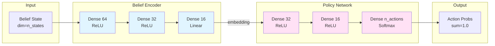
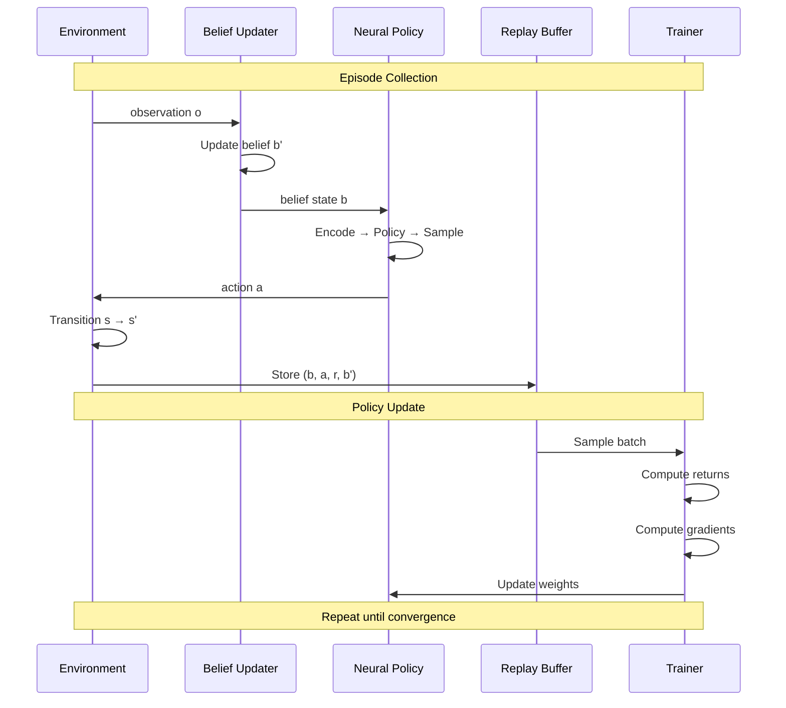
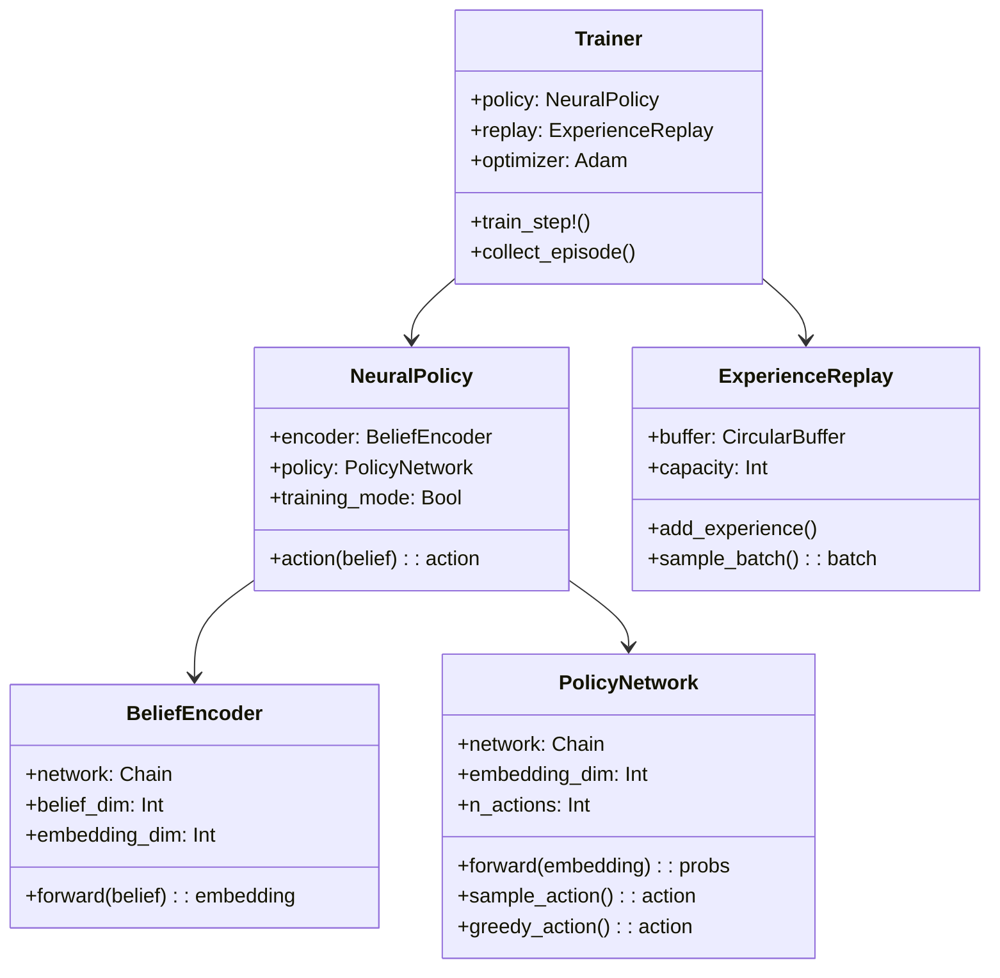
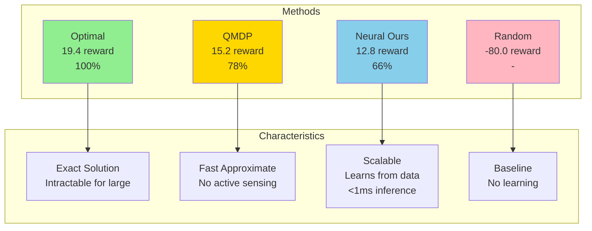

# Architecture Diagrams

**Note**: These diagrams are in Mermaid format. To convert to PNG:
1. Copy diagram code
2. Go to https://mermaid.live
3. Paste code
4. Export as PNG

Or use VS Code with Mermaid extension.

---

## System Overview

```mermaid
graph TB
    subgraph "POMDP Environment"
        ENV[Environment State]
        OBS[Observation]
    end
    
    subgraph "Belief System"
        BU[Belief Updater]
        BELIEF[Belief State<br/>P(s|history)]
    end
    
    subgraph "Neural Policy"
        BE[Belief Encoder<br/>belief_dim → 16]
        PN[Policy Network<br/>16 → n_actions]
        SAMPLE[Action Sampling]
    end
    
    ENV -->|observation| OBS
    OBS -->|update| BU
    BU -->|belief distribution| BELIEF
    BELIEF -->|probability vector| BE
    BE -->|embedding 16-dim| PN
    PN -->|action probs| SAMPLE
    SAMPLE -->|action| ENV
    
    style BE fill:#e1f5ff
    style PN fill:#ffe1f5
    style BELIEF fill:#f5ffe1
```

---

## Neural Network Architecture



---

## Training Pipeline

```mermaid
graph TD
    START[Start Training] --> COLLECT[Collect Episode]
    
    subgraph "Episode Collection"
        COLLECT --> INIT[Initialize Belief]
        INIT --> SELECT[Select Action<br/>from Policy]
        SELECT --> EXECUTE[Execute in POMDP]
        EXECUTE --> UPDATE[Update Belief]
        UPDATE --> STORE[Store Experience<br/>b, a, r, b']
        STORE --> CHECK{Terminal?}
        CHECK -->|No| SELECT
        CHECK -->|Yes| DONE[Episode Complete]
    end
    
    DONE --> REPLAY[Add to Replay Buffer]
    
    subgraph "Policy Update"
        REPLAY --> SAMPLE[Sample Batch<br/>size=32]
        SAMPLE --> RETURNS[Compute Returns<br/>discounted + baseline]
        RETURNS --> GRAD[Policy Gradient<br/>∇log π(a|b) * R]
        GRAD --> OPTIM[Adam Optimizer<br/>Update Weights]
    end
    
    OPTIM --> EVAL{Evaluate?}
    EVAL -->|Every 10 eps| METRICS[Compute Metrics]
    EVAL -->|No| CONTINUE{More Episodes?}
    METRICS --> CONTINUE
    CONTINUE -->|Yes| COLLECT
    CONTINUE -->|No| END[Training Complete]
    
    style COLLECT fill:#e1f5ff
    style REPLAY fill:#ffe1f5
    style GRAD fill:#f5ffe1
```

---

## Data Flow



---

## Component Interaction



---

## Belief Space Visualization (Tiger POMDP)

```mermaid
graph LR
    subgraph "Belief Space"
        B0[P(left)=0.0<br/>Certain Right]
        B25[P(left)=0.25<br/>Likely Right]
        B50[P(left)=0.5<br/>Uncertain]
        B75[P(left)=0.75<br/>Likely Left]
        B100[P(left)=1.0<br/>Certain Left]
    end
    
    subgraph "Policy Actions"
        A1[Open Left<br/>90%]
        A2[Listen<br/>70%]
        A3[Open Right<br/>90%]
    end
    
    B0 -.->|High prob| A1
    B25 -.->|Medium prob| A1
    B50 -.->|High prob| A2
    B75 -.->|Medium prob| A3
    B100 -.->|High prob| A3
    
    style B0 fill:#ff9999
    style B50 fill:#ffff99
    style B100 fill:#99ff99
    style A2 fill:#99ccff
```

---

## Performance Comparison



---

## Conversion Instructions

### Using mermaid.live (Easiest)

1. Go to https://mermaid.live
2. Copy any diagram code above
3. Paste into editor
4. Click "Export" → "PNG"
5. Save to `plots/` directory

### Using VS Code

1. Install "Markdown Preview Mermaid Support" extension
2. Open this file in VS Code
3. Click "Preview" button
4. Right-click diagram → "Copy Image"
5. Paste into image editor → Save as PNG

### Using CLI (Advanced)

```bash
# Install mermaid-cli
npm install -g @mermaid-js/mermaid-cli

# Convert diagram
mmdc -i diagram.mmd -o diagram.png
```

---

## Recommended Exports

For portfolio/GitHub:
1. **system_overview.png** - Main architecture
2. **neural_architecture.png** - Network details
3. **training_pipeline.png** - Training flow
4. **performance_comparison.png** - Results visualization

Place in `plots/` directory alongside training curves.
