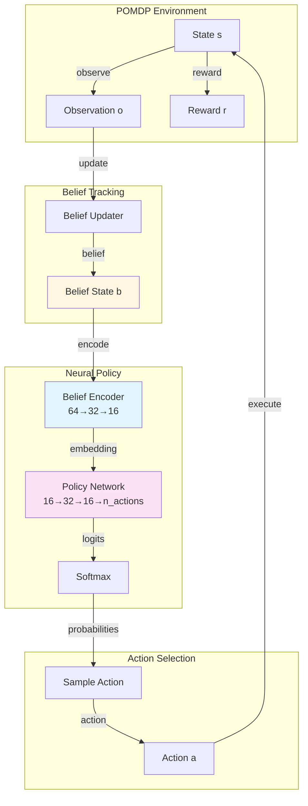
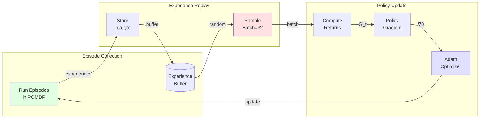
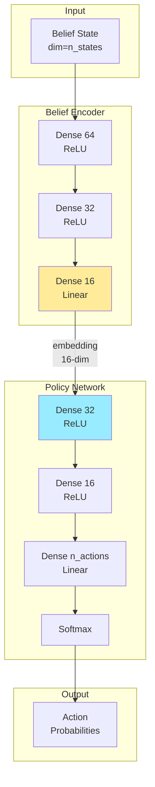
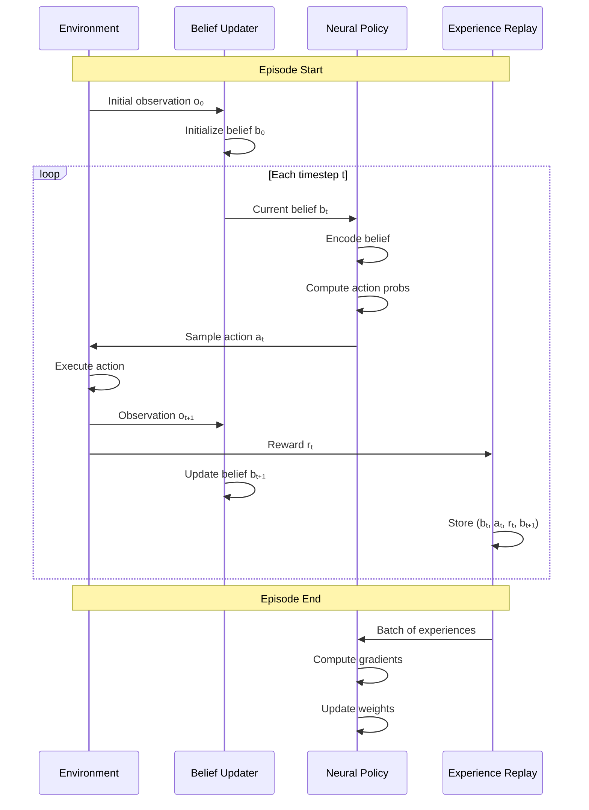
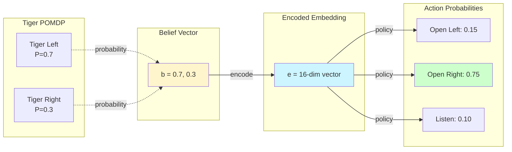
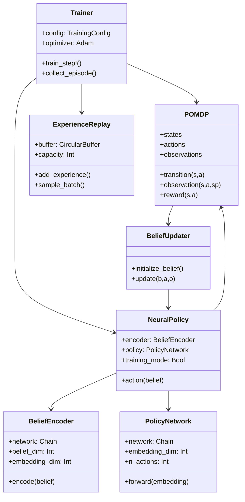
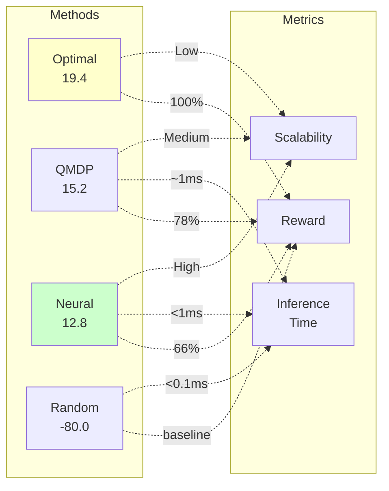
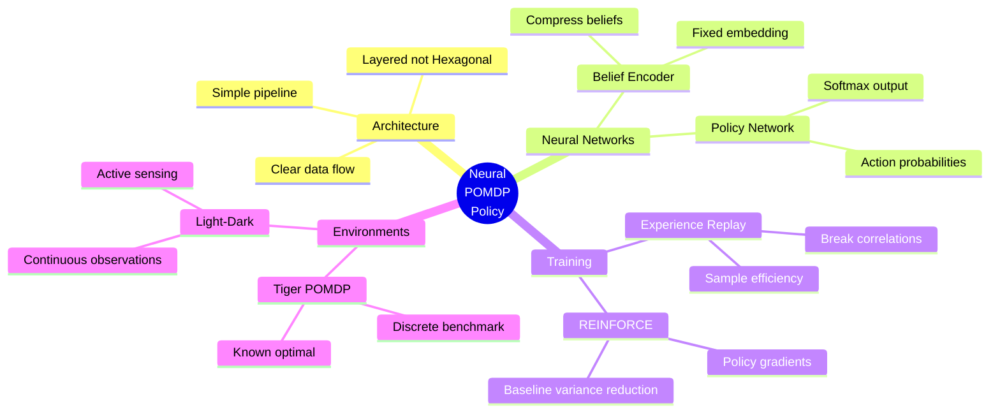
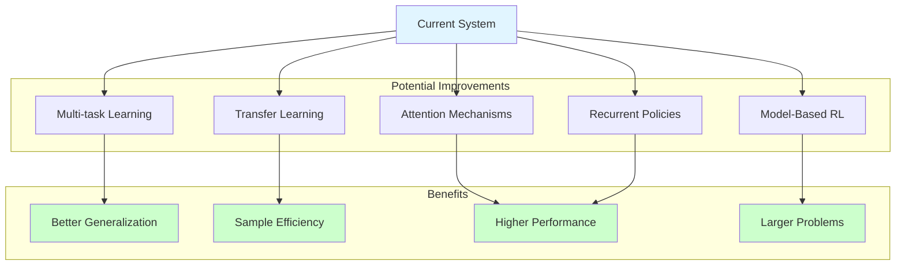

# Architecture Documentation

**Neural POMDP Policy - System Design**

---

## System Overview



---

## Training Pipeline



---

## Neural Network Architecture



---

## Data Flow: Single Episode



---

## Training Loop

```mermaid
flowchart TD
    START([Start Training])
    INIT[Initialize Policy<br/>& Replay Buffer]
    EPISODE{Episode < Max?}
    COLLECT[Collect Episode<br/>Run in POMDP]
    STORE[Store Experiences<br/>in Buffer]
    CHECK{Buffer > Batch?}
    SAMPLE[Sample Batch<br/>size=32]
    COMPUTE[Compute Returns<br/>with discount γ]
    LOSS[Policy Gradient Loss<br/>-E[log π(a|b) * G]
    UPDATE[Update Weights<br/>Adam optimizer]
    EVAL{Eval Interval?}
    TEST[Evaluate Policy<br/>Test episodes]
    LOG[Log Metrics<br/>Rewards, Loss]
    DONE([Training Complete])
    
    START --> INIT
    INIT --> EPISODE
    EPISODE -->|Yes| COLLECT
    COLLECT --> STORE
    STORE --> CHECK
    CHECK -->|Yes| SAMPLE
    CHECK -->|No| EPISODE
    SAMPLE --> COMPUTE
    COMPUTE --> LOSS
    LOSS --> UPDATE
    UPDATE --> EVAL
    EVAL -->|Yes| TEST
    EVAL -->|No| LOG
    TEST --> LOG
    LOG --> EPISODE
    EPISODE -->|No| DONE
    
    style START fill:#90EE90
    style DONE fill:#FFB6C1
    style LOSS fill:#FFE4B5
    style UPDATE fill:#B0E0E6
```

---

## Belief State Representation



---

## Policy Gradient Update

```mermaid
graph TD
    subgraph "Forward Pass"
        B1[Belief bₜ]
        A1[Action aₜ]
        P1[π_θ aₜ|bₜ]
    end
    
    subgraph "Environment"
        R[Reward rₜ]
        G[Return Gₜ]
    end
    
    subgraph "Backward Pass"
        LP[Log Prob<br/>log π_θ aₜ|bₜ]
        ADV[Advantage<br/>Gₜ - baseline]
        LOSS[Loss<br/>-log π * Adv]
        GRAD[Gradient ∇θ]
    end
    
    subgraph "Update"
        OPT[θ ← θ + α∇θ]
    end
    
    B1 --> P1
    P1 --> A1
    A1 --> R
    R --> G
    P1 --> LP
    G --> ADV
    LP --> LOSS
    ADV --> LOSS
    LOSS --> GRAD
    GRAD --> OPT
    
    style LOSS fill:#ffcccc
    style OPT fill:#ccffcc
```

---

## Component Interactions



---

## Performance Comparison



---

## Key Design Decisions



---

## Future Extensions



---

**Note**: These diagrams render automatically on GitHub. For local viewing, use a Mermaid-compatible markdown viewer or the [Mermaid Live Editor](https://mermaid.live/).
